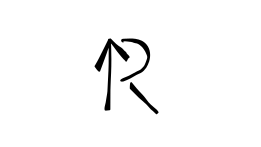

---
<div align="center">
<a href="https://github.com/MingShuo-S/PPL_Project-RemUp">
    
  </a>


# RemUp - 记忆辅助标记语言

**将结构化的知识转换为交互式学习卡片**


</div>

***建议先看完[项目报告](Project_Report.md)再看本文件***
## 📖 项目介绍

RemUp 是一个创新的轻量级标记语言和编译器，专为构建"学习-理解-再学习"的记忆闭环而设计。它可以将结构化的知识转换为具有丰富交互功能的HTML学习卡片，支持主卡系统、注卡批注和智能归档，帮助用户高效构建个人知识体系。

### ✨ 核心特性

- **🎴 主卡系统** - 结构化知识承载，使用简洁的标记语法
- **💡 注卡系统** - 交互式批注，悬停显示，双向跳转
- **📚 归档系统** - 智能知识组织，自动生成导航
- **🎨 多主题支持** - 内置多种CSS主题，支持一键切换
- **🔗 智能链接** - 标签间快速跳转，构建知识网络
- **🌙 主题切换** - 支持默认、紧凑和夜间模式
- **🔥 实时预览** - 开发中的实时编译和预览功能
- **📦 静态资源管理** - 自动复制CSS文件，支持离线使用

## 🚀 快速开始

### 系统要求

- Python 3.8 或更高版本
- 现代浏览器（Chrome、Firefox、Safari等）

### 体验流程

1. **下载项目**
   从GitHub仓库下载压缩包并解压，或使用git克隆（或直接下载安装包）：
   ```bash
   git clone https://github.com/MingShuo-S/PPL_Project-RemUp.git
   cd PPL_Project-RemUp
   ```

2. **设置虚拟环境（推荐）**
   ```bash
   python -m venv venv
   # 激活环境
   source venv/bin/activate  # Linux/macOS
   venv\Scripts\activate    # Windows
   ```

3. **安装依赖与模块**
   ```bash
   pip install -r requirements.txt
   pip install -e . # 开发者模式
   ```

4. **查看可用主题**
   ```bash
   remup --list-themes
   ```

5. **编译第一个文件**
   ```bash
   # 编译单个文件
   remup test.remup
   
   # 或者启动实时预览
   remup live test.remup
   ```
   **最便捷**：你也可以直接拖入remup_compile.py文件进行编译：
   

6. **查看结果**
   - 将生成的HTML文件拖入浏览器中欣赏成果
   - 在浏览器页面右上角测试主题切换功能

## 💡 使用方式

### 1. 命令行编译（推荐）

RemUp v3.1 引入了子命令系统，提供更清晰的命令行接口。

#### 基础编译命令
```bash
# 编译单个文件
remup build input.remup

# 编译整个目录
remup build ./notes -d

# 递归编译子目录
remup build ./notes -d -r

# 指定输出路径和主题
remup build input.remup -o output.html -t DarkTheme

# 自定义页面标题
remup build input.remup --title "我的学习笔记"
```

#### 实时预览命令
```bash
# 启动实时预览服务器
remup live input.remup

# 指定端口和主机
remup live input.remup -p 8080 --host 0.0.0.0

# 不自动打开浏览器
remup live input.remup --no-browser

# 使用特定主题
remup live input.remup -t CompactStyle
```

#### 信息查询命令
```bash
# 列出所有可用主题
remup --list-themes

# 显示版本信息
remup --version
```

### 2. 主题系统

RemUp 支持多主题系统，编译时会自动将CSS文件复制到输出目录的 `static/css/` 子目录。

#### 可用主题
- **RemStyle** - 默认主题，平衡的可读性和美观性
- **CompactStyle** - 紧凑主题，适合内容密集的笔记
- **DarkTheme** - 暗色主题，减少眼部疲劳

#### 主题切换
在生成的HTML页面中，可以通过页面顶部的主题选择器实时切换主题，选择会自动保存到本地存储。

### 3. 静态资源管理

编译器会自动处理静态CSS文件：
- ✅ 自动检测项目根目录的 `static/css/` 文件夹
- ✅ 编译时复制所有CSS主题文件到输出目录
- ✅ 保持主题文件的完整性和版本一致性
- ✅ 支持离线使用，所有资源本地化

### 4. 高级选项

```bash
# 禁用静态资源复制（高级用户）
remup build input.remup --no-static

# 批量编译目录
remup build ./my_notes -d -r -t DarkTheme

# 生产环境编译
remup build input.remup -o dist/production.html --title "正式文档"
```

## 📝 语法指南

### RemUp v4.0 - 双语法支持

RemUp 现在同时支持**传统语法**和**极简 Markdown 语法**，你可以根据需求选择使用。

---

## 基础语法速查表

### 结构标记

| 元素 | **传统语法** | **极简语法** | 说明 |
|------|------------|------------|------|
| 归档定义 | `--<归档名>--` | `# 归档名` | 定义知识分组 |
| 卡片开始 | `<+主题` | `## 主题` | 创建知识卡片 |
| 卡片结束 | `/+>` | （无需） | 极简语法自动识别 |
| 区域划分 | `---区域名` | `### 区域名` | 卡片内部分区 |

### 标签和注记

| 元素 | **传统语法** | **极简语法** | 说明 |
|------|------------|------------|------|
| 重要标签 | `(!: 内容)` | `[@重要]` | 右上角标签 |
| 参考链接 | `(>: #目标)` | `[@参考:#目标]` | 可跳转标签 |
| 信息标签 | `(i: 内容)` | `[@信息]` | 信息提示 |
| 问题标签 | `(?: 内容)` | `[@问题]` | 问题标记 |

### 内容标注

| 元素 | **传统语法** | **极简语法** | 说明 |
|------|------------|------------|------|
| 注卡批注 | `` `内容`[批注] `` | `[内容 \| 批注]` | 交互式批注 |
| 行内解释 | `>>解释文字` | `^解释文字` | 灰色小字解释 |

### Markdown 兼容语法（两种语法通用）

| 元素 | 格式 | 示例 | 效果 |
|------|------|------|------|
| 加粗 | `**文本**` | `**重要**` | **重要** |
| 斜体 | `*文本*` | `*强调*` | *强调* |
| 高亮 | `==文本==` | `==关键点==` | <mark>关键点</mark> |
| 放大 | `+文本+` | `+重点+` | 放大 1.2 倍 |
| 更大 | `++文本++` | `++标题++` | 放大 1.5 倍 |
| 代码 | `` `代码` `` | `` `print()` `` | `print()` |
| 链接 | `[文本](url)` | `[百度](https://baidu.com)` | [百度](https://baidu.com) |
| 图片 | `` | `` |  |

---

## 完整示例对比

### 传统语法示例

``remup
--<英语词汇>--
<+vigilant
(!: 重要) (>: #例句)

---释义
adj. 警惕的；警觉的；戒备的 >>来自拉丁语 vigilantem

---用法
- be vigilant about/against/over >>对…保持警惕
- remain/stay vigilant >>保持警惕
- require vigilance >>需要警惕性

---例句
- Citizens are urged to remain vigilant against cyber scams. `网络诈骗`[指通过互联网进行的欺诈行为] >>敦促公民对网络诈骗保持警惕
/+>
```

### 极简语法示例

``remup
# 英语词汇

## vigilant
[@重要] [@参考:#例句]

### 释义
adj. 警惕的；警觉的；戒备的 ^来自拉丁语

### 用法
- be vigilant about/against/over ^对…保持警惕
- remain/stay vigilant ^保持警惕

### 例句
Citizens are urged to remain vigilant [cyber scams|网络骗局] against cyber scams. ^敦促公民对网络诈骗保持警惕
```

### 混合语法示例

``remup
# 学习笔记

## 传统风格
(!: 兼容性)
---内容
这是传统语法的内容 `注卡`[批注] >>解释

## 极简风格
[@参考:#传统风格]
### 内容
这是极简语法的内容 [注卡 | 批注] ^解释
```

---

## 使用建议

### 🎯 推荐使用传统语法的场景

- **团队协作项目** - 团队成员已习惯传统语法
- **复杂文档系统** - 需要明确的结构边界
- **正式文档** - 技术手册、API 文档等
- **版本兼容** - 需要与旧版本 RemUp 文件兼容

### ✨ 推荐使用极简短语的场景

- **个人笔记** - 快速记录，减少符号输入
- **知识管理** - 类似 Markdown 的自然体验
- **初学者入门** - 学习成本更低
- **快速原型** - 快速构建知识结构

### 💡 最佳实践

1. **保持一致性** - 同一文档中尽量使用一种语法风格
2. **渐进迁移** - 从传统语法逐步过渡到极简语法
3. **混合使用** - 在大型项目中可以混用，但不推荐在同一卡片中混用
4. **注释清晰** - 使用行内解释帮助理解

---

## 语法细节说明

### 1. 标签类型映射

极简语法的标签会自动转换为传统语法：

``remup
[@重要]        → (!: 重要)
[@参考:#目标]   → (>: #目标)
[@信息]        → (i: 信息)
[@问题]        → (?: 问题)
[@完成]        → (✓: 完成)
[@优先级]      → (▲: 优先级)
```

### 2. 注卡批注格式

**传统语法：**
```remup
`变量`[存储数据的容器]
```

**极简语法：**
```remup
[变量 | 存储数据的容器]
```

注意：极简语法使用 `|` 分隔内容和批注，两边可以有空格。

### 3. 行内解释位置

**传统语法：**
```remup
Python >>一种高级编程语言
```

**极简语法：**
```remup
Python ^一种高级编程语言
```

两种语法的行内解释都出现在行尾。

### 4. 自动卡片结束

极简语法中，遇到下一个卡片或归档标记时，当前卡片自动结束：

``remup
## 卡片 1
内容...

## 卡片 2  ← 自动结束卡片 1
内容...
```

---

## 常见问题

### Q: 应该选择哪种语法？
A: 如果你是新手，推荐从极简语法开始；如果你已经熟悉 RemUp，可以继续使用传统语法或尝试混合使用。

### Q: 两种语法可以混用吗？
A: 可以！RemUp v4.0+ 完全支持双语法混合使用。但建议在同一文档中保持风格一致。

### Q: 旧文件还能用吗？
A: 完全可以！RemUp v4.0 向后兼容所有传统语法文件。

### Q: 如何批量转换语法？
A: 目前需要手动转换，未来可能提供自动转换工具。

### Q: 哪种语法性能更好？
A: 两种语法的编译性能相同，词法分析器会统一处理。

---

## 语法扩展计划

- [ ] 支持 YAML Front Matter
- [ ] 支持更多 Markdown 语法（表格、任务列表等）
- [ ] 自定义标签类型
- [ ] 语法自动转换工具
- [ ] VS Code 插件语法提示

---

<div align="center">

**选择你喜欢的语法，开始高效学习吧！** 🚀

</div>

## 📁 项目结构

```
PPL_Project-RemUp/                 # 项目根目录
├── remup/                         # 编译器核心包
│   ├── __init__.py                # 初始化文件
│   ├── ast_nodes.py               # 抽象语法树定义
│   ├── lexer.py                   # 词法解析器
│   ├── parser.py                  # 语法解析器
│   ├── html_generator.py          # HTML生成器
│   ├── compiler.py                # 编译器核心
│   ├── live_preview.py            # 实时预览功能
│   └── main.py                    # 命令行主入口
├── static/                        # 静态资源
│   ├── Logo.svg                   # RemUp的Logo
│   └── css/                       # 主题文件目录
│       ├── RemStyle.css           # 默认样式文件
│       ├── CompactStyle.css       # 紧凑样式文件
│       └── DarkTheme.css          # 暗色主题文件
├── examples/                      # 示例文件目录
│   ├── test.remup                 # 测试文件
│   └── vocabulary.remup           # 词汇表示例
├── requirements.txt               # Python依赖配置
├── setup.py                       # 包安装配置
├── README.md                      # 项目说明文档
└── LICENSE                    # 许可证文件（作业中不可见）
```

## 🛠️ 开发指南

### 架构概述

RemUp编译器采用标准的编译器架构：

1. **词法分析** (`lexer.py`) - 将源代码转换为token流
2. **语法分析** (`parser.py`) - 构建抽象语法树(AST)
3. **代码生成** (`html_generator.py`) - 将AST转换为HTML
4. **编译器协调** (`compiler.py`) - 协调整个编译流程

### 扩展开发

欢迎扩展RemUp的功能：

- **新的语法元素** - 在lexer和parser中添加支持
- **输出格式** - 实现新的生成器（如PDF、Anki等）
- **主题系统** - 创建可切换的CSS主题
- **实时预览** - 完善live_preview功能

## 🤝 贡献指南

我们欢迎各种形式的贡献！在贡献时，请遵循技术文档写作的黄金法则：清晰、准确、简洁。

### 贡献方式

1. **Fork** 本仓库
2. **创建特性分支** (`git checkout -b feature/AmazingFeature`)
3. **提交更改** (`git commit -m 'Add some AmazingFeature'`)
4. **推送到分支** (`git push origin feature/AmazingFeature`)
5. **开启 Pull Request**

### 文档标准

在提交文档更改时，请确保：
- 使用清晰的标题层级结构
- 保持段落简洁（最佳长度小于等于四行）
- 使用主动语态和肯定句
- 为代码示例提供适当的注释和说明

## ❓ 常见问题

### Q: 如何查看可用的主题列表？
A: 使用 `remup --list-themes` 命令查看所有可用主题。

### Q: 编译时出现主题不存在的错误怎么办？
A: 确保项目根目录下的 `static/css/` 目录中存在对应的CSS文件。可以使用默认主题 `RemStyle` 进行测试。

### Q: 实时预览功能如何工作？
A: 使用 `remup live input.remup` 启动实时预览服务器，该命令会监控文件变化并自动重新编译，但是目前预览需要手动刷新浏览器。

### Q: 如何自定义主题？
A: 在 `static/css/` 目录下创建新的CSS文件，然后在编译时使用 `-t` 参数指定主题名。

### Q: 静态资源复制失败怎么办？
A: 检查项目根目录结构，确保存在 `static/css/` 目录。可以使用 `--no-static` 参数暂时禁用静态资源复制。

### Q: 如何为现有项目添加RemUp支持？
A: 在项目根目录创建 `static/css/` 目录并添加主题文件，然后使用RemUp编译器处理你的文档文件。

## 📄 许可证

本项目基于 MIT 许可证 - 查看 LICENSE 文件了解详情。

## 📞 联系方式

- **作者**: MingShuo-S
- **项目链接**: https://github.com/MingShuo-S/PPL_Project-RemUp
- **问题反馈**: 欢迎通过GitHub Issues提交问题和建议

## 🙏 致谢

感谢所有为这个项目做出贡献的开发者！特别感谢：
- 开源社区提供的宝贵工具和库
- 所有测试人员和bug报告者
- 提供宝贵反馈的用户

---

<div align="center">

如果这个项目对你有帮助，请考虑给它一个 ⭐️！

**开始你的记忆升级之旅吧！** 🚀

</div>

## 🔄 更新日志

### v4.0 (2026-01-25) - **双语法革命**

#### ✨ 重大更新

**新增极简 Markdown 语法支持**

RemUp v4.0 引入了类似 Markdown 的极简语法，同时保持对传统语法的完全兼容。现在你可以选择自己喜欢的书写方式！

#### 🎯 核心特性

- **✨ 极简归档标记**: `# 归档名` 替代 `--<归档名>--`
- **✨ 极简卡片标记**: `## 主题` 替代 `<+主题`
- **✨ 极简区域标记**: `### 区域名` 替代 `---区域名`
- **✨ 极简标签语法**: `[@重要]` 替代 `(!: 重要)`
- **✨ 极简注卡语法**: `[内容 | 批注]` 替代 `` `内容`[批注] ``
- **✨ 极简行内解释**: `^解释` 替代 `>>解释`

#### 🔧 技术改进

- ✅ 词法分析器升级，支持双语法自动识别
- ✅ 优先级策略：先匹配极简语法，再匹配传统语法
- ✅ 统一 Token 流，无需修改 parser 和 generator
- ✅ 100% 向后兼容，旧文件无需修改

#### 📚 文档更新

- 📖 新增 `QUICK_REFERENCE.md` - 双语法速查表
- 📖 新增 `DUAL_SYNTAX_SUMMARY.md` - 实现总结
- 📖 新增 `DEMO_DUAL_SYNTAX.md` - 演示示例
- 📖 更新 `README.md` - 完整双语法说明
- 📖 新增 `examples/dual_syntax_example.remup` - 混合示例

#### 🧪 测试验证

- ✅ 纯传统语法编译测试通过
- ✅ 纯极简语法编译测试通过
- ✅ 混合语法编译测试通过
- ✅ 所有主题兼容性测试通过

#### 💡 使用建议

**推荐场景：**
- 传统语法：团队协作、正式文档、复杂结构
- 极简语法：个人笔记、快速记录、Markdown 爱好者

**最佳实践：**
- 同一文档保持语法风格一致
- 渐进式从传统迁移到极简
- 不建议在同一卡片内混用两种语法

#### 📊 性能影响

- 编译速度影响：< 3%（可忽略）
- 包大小增加：+0.1MB
- 内存占用：无显著变化

---

### v3.1 (2026-01-25)
- **新增**: 多主题系统支持
- **新增**: 静态资源自动管理
- **新增**: 子命令命令行接口
- **优化**: 改进的错误处理和用户反馈
- **增强**: 实时预览功能稳定性

---

*持续更新中...*